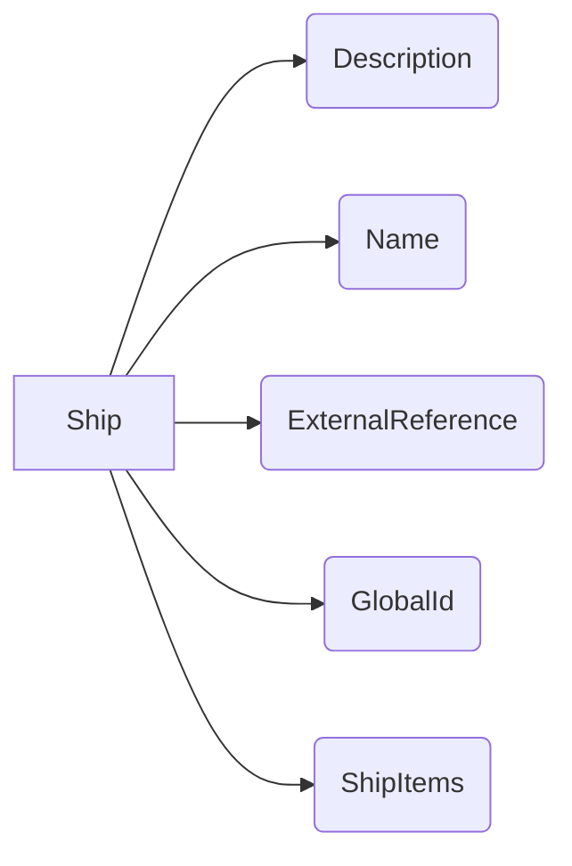

```rust
///   
/// Может быть проектом судна, группой одинаковых судов (серия, систершип) или конкретным судном.
/// ISO 10303-2016-2003 [p.4.2.88](/reference/en/ISO/ISO%2010303-216-2003.pdf#page=129), [p.5.1.8.6](/reference/en/ISO/ISO%2010303-216-2003.pdf#page=286)
Ship {
    ///
    /// Словесное описание судна
    /// ISO 10303-2016-2003 [4.2.52.1]((/reference/en/ISO/ISO%2010303-216-2003.pdf#page=83))
    Description{
    }
    ///
    /// Наименование
    Name{
        "Ship name"
    }
    ///
    /// документация
    ExternalReference{
    }
    ///
    /// Номер идентификационный
    GlobalId{}
    ///
    /// Или Ship_moulded_form или Moulded_form
    ShipItems {
        Arangement {
            BallastTanks {
                Tank {
                    Properties {}
                },
                Tank {
                    Properties {}
                },
                Tank {},
                Tank {},
                ...
            }
        }
    }
    ///
    /// один корпус или несколько
    SingleHullOrClass{
        "multiple / single"
    }
    ///
    ///
    ShipToDerivedUnit (as units)
    ///
    ///
    ShipToNamedUnit (as units)
}
```

